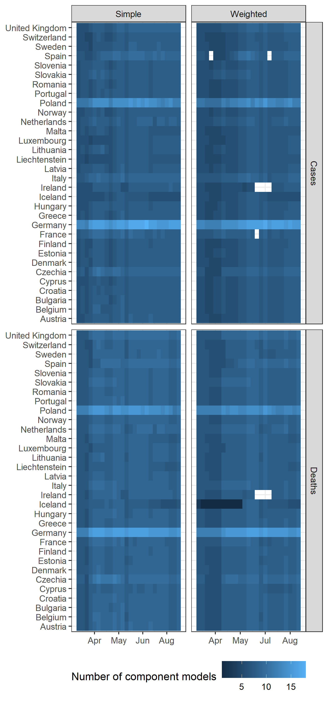
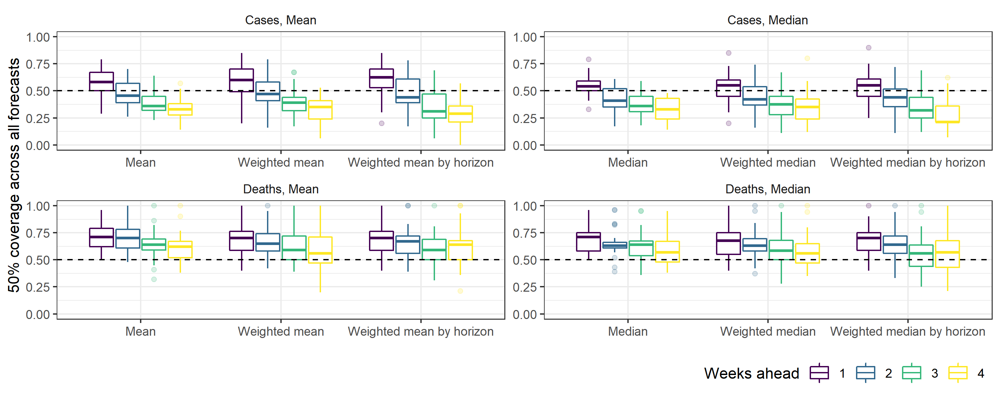

```{r setup, include=FALSE}
knitr::opts_chunk$set(warning = FALSE,
                      message = FALSE,
                      echo = FALSE)
library(here)
file_path <- here("code", "papers", "ensemble-eval")
source(here(file_path, "R", "weights.R"))
source(here(file_path, "R", "description.R"))
```

## Results

### Component forecasts



We created forecasts over the period `r min(weights$forecast_date)` to `r max(weights$forecast_date)`. For each week, we created six probabilistic ensemble forecasts of incident weekly case and death counts for 32 countries, forecasting over one through to four weeks (a combined `r 2*32*4` targets). This created `r n_targets` evaluated ensembles, after removing `r n_removed` weeks of forecasts in countries reporting data anomalies.

We collected forecasts from a total `r length(unique(weights$model))` modelling teams. Ensembles taking the simple averages (mean, median) of all forecasts for each week included between `r component_models_desc$Simple$min` and `r component_models_desc$Simple$max` component models over time. The weighted average ensembles used a stricter set of inclusion criteria, reducing the number of component models to between `r component_models_desc$Weighted$min` and `r component_models_desc$Weighted$max`.


#### Relative performance and uncertainty

For the majority of forecast targets, ensembles performed better than the baseline. Of the `r n_targets` combinations of the six ensemble methods each forecasting four weeks of case and death counts in 32 countries, `r 100-overall_worse_same_pc`% performed better than the baseline forecast model.

Ensemble forecasts consistently performed better compared to the baseline model when forecasting incident deaths. With a total `r by_target$Deaths$total` targets for incident deaths, `r 100 - by_target$Deaths$worse_or_same_pc`% ensembles outperformed the baseline model. This was `r 100 - by_target$Cases$worse_or_same_pc`% of the same number of case targets.

For all ensemble methods, the skill of ensemble forecasts varied from the near to further into the future, relative to the baseline model. For each model this was always a consistent trend in gradually improving or worsening skill over longer horizons. However the direction of trend varied by the epidemiological target being forecast. Forecasting cases proved more difficult at longer forecast targets than shorter horizons. However, the relative skill of ensembles in forecasting incident deaths improved over longer horizons.



When forecasting deaths, ensembles of any model across all horizons typically gave too broad a range of uncertainty. This was also true when forecasting case counts at the one-week ahead horizon for both mean and median varieties of ensemble.

For both targets, the problem of underconfident prediction intervals improved over longer horizons. This only improved forecasts of incident deaths, with the coverage of the 50% prediction interval the most accurate at four weeks. However case forecasts became overconfident in nearly all locations by the three and four week horizon.

#### Averaging methods

Ensemble forecasts that used any form of median outperformed the baseline model across all horizons and for each of 32 locations. The `r by_ensemble_type$Median$total` ensembles using a median outperformed the baseline for `r 100 - by_ensemble_type$Median$worse_or_same_pc`% targets. Ensembles using the mean were less consistent in performance across countries, while still outperforming the baseline for `r 100 - by_ensemble_type$Mean$worse_or_same_pc`% targets.

Forecasts for Iceland were a notable outlier, where mean forecasts failed to accurately forecast regardless of the type of mean ensemble used. This includes the worst of any ensemble performance, where the simple mean of forecasts for incident deaths in Iceland at three weeks ahead performed over seven times worse than the baseline forecast.

#### Weighting methods


Weighting by skill created substantial differences in the contribution of individual models compared to weighting all models equally (figure \#), and these differences varied by target and over time (for more on relative performance of individual models, see forecast report). However, weighting by skill had relatively little impact on the performance of ensembles compared to simple equal weights. Of 256 targets, there was no greater than 2% difference in the number of ensemble forecasts that outperformed the baseline, between ensembles weighted by skill on average, by horizon, or a simple average for each of the mean and median approaches.
