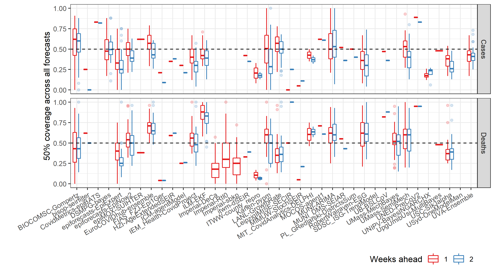

Guide to code
================
25/08/2021

### Generate results

Results text including numbers and figures can be created with

``` r
rmarkdown::render(here::here("code", "papers", "forecast-eval", "results.Rmd"))
```

### Data access

To access the raw dataset of forecasts used here, use:

``` r
source(here::here(file_path, "R", "get-forecasts.R"))
```

To access the evaluation scores used here, use:

``` r
source(here::here(file_path, "R", "get-eval.R"))
```

Anonymous responses to the survey are saved in an excel file:
`data/survey-responses.xlsx`

### Analysis

All code is written in R and designed with the European hub repo as the
root directory.

First set a common file path to this folder to avoid navigating through
the whole hub repository:

``` r
file_path <- here::here("code", "papers", "forecast-eval")
```

#### Description of forecasts

Code to support description of the forecast models by various
stratifications (team, locations, horizons, variable):

``` r
here::here(file_path, "R", "forecast-description.R")
```

#### Forecast scoring

Forecasts were scored using the cut off date 2021-08-23. Note that all
models are included with a minimum of any four forecasts. This is
different from the weekly evaluation, where only models that have
submitted in the last four weeks continuously are included.

``` r
here::here(file_path, "R", "re-run-eval.R")
```

See also the weekly code to create the evaluation scores, saved under:
`here::here("code", "reports", "evaluation")`.

#### Score summaries

Describe and plot models’ relative AE and get the top ranked models
with:

``` r
here::here(file_path, "R", "model-relative-ae.R")
```


Get and plot coverage with:

``` r
here::here(file_path, "R", "coverage.R")
```



Calculate and plot average score by location with:

``` r
here::here(file_path, "R", "location-absolute-score.R")
```


Load truth data and plot for a single location (here for France) with:

``` r
here::here(file_path, "R", "plot-single-location.R")
```


