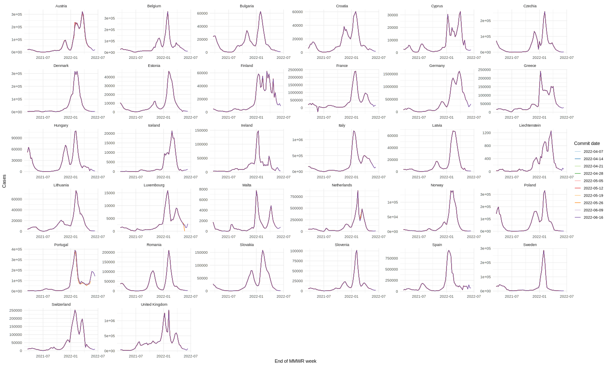
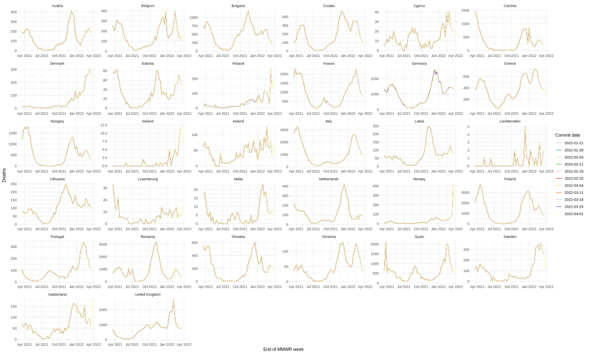
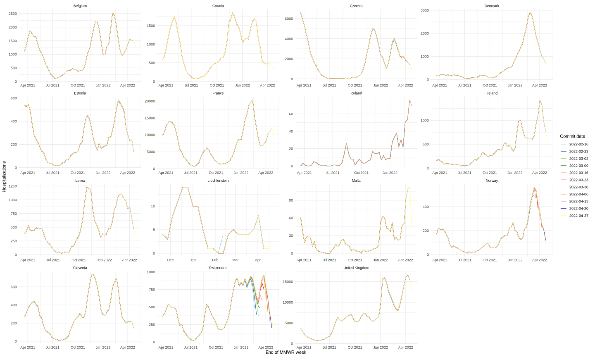

European data status
================

## Truth data

### Cases and deaths

We evaluate forecasts of cases and deaths against [Johns Hopkins
University data](https://github.com/CSSEGISandData/COVID-19), and we
recommend using this dataset as the basis for forecasts.

- Daily numbers of cases and deaths are available to download from
  [JHU](https://github.com/CSSEGISandData/COVID-19/tree/master/csse_covid_19_data/csse_covid_19_time_series),
  or from [our
  repository](https://github.com/epiforecasts/covid19-forecast-hub-europe/data-truth).
- JHU also provide [country
  metadata](https://github.com/CSSEGISandData/COVID-19/blob/master/csse_covid_19_data/UID_ISO_FIPS_LookUp_Table.csv),
  including population counts and ISO-3 codes.

Note there are some differences between the format of the JHU data and
what we require in a forecast. Please check the
[Wiki](https://github.com/epiforecasts/covid19-forecast-hub-europe/wiki/Targets-and-horizons#truth-data)
for more on forecast formatting.

#### Potential issues in the JHU dataset

As of 2023-01-30

| country     | created    | updated    | issue                                                               | message                                             | url                                                      |
|:------------|:-----------|:-----------|:--------------------------------------------------------------------|:----------------------------------------------------|:---------------------------------------------------------|
| iceland     | 2023-01-11 | 2023-01-11 | patch iceland data from 11/01/2022 to 01/10/2023                    | November 1, 2022: 206571 cases November 8, 2022: 2… | <https://github.com/CSSEGISandData/COVID-19/issues/6462> |
| france      | 2023-01-04 | 2023-01-06 | martinique (france) cases and deaths does not match source          | In the WHO report there are 225249 cases and 1079 … | <https://github.com/CSSEGISandData/COVID-19/issues/6432> |
| netherlands | 2023-01-06 | 2023-01-06 | netherlands rivm ceases reporting covid-19 deaths as of jan 1, 2023 | Hello all, On January 1, 2023, the Netherlands’ R…  | <https://github.com/CSSEGISandData/COVID-19/issues/6446> |
| france      | 2022-12-26 | 2022-12-31 | martinique (france) cases not updating data from 11/22/2022         | The latest update I found on the WHO website was o… | <https://github.com/CSSEGISandData/COVID-19/issues/6401> |

Open issues updated over the last eight weeks: from [JHU CSSEGISandData
Github](https://github.com/CSSEGISandData/COVID-19/)

### Hospitalisations

We gather general hospital admissions data from various sources. See
separate [Hospitalisations
README](https://github.com/epiforecasts/covid19-forecast-hub-europe/tree/main/code/auto_download/hospitalisations#readme).

Hospitalisation data can be difficult to produce and interpret, and is
not consistent across all the countries in the ECDC Forecast Hub. To
keep data and forecasts consistent, we include hospitalisations
forecasts for the following locations only:

- Belgium, France, Greece, Ireland, Latvia, Liechtenstein, Malta,
  Slovakia, Slovenia

The Hub validates and evaluates forecasts against the single dataset in
[ECDC/truth_ECDC-Incident
Hospitalizations.csv](ECDC/truth_ECDC-Incident%20Hospitalizations.csv).
While we provide raw data files with multiple sources for
hospitalisation data in each location, this is for reference only to
cover daily as well as weekly data.

#### Data revisions

##### Cases

##### Deaths

##### Hospitalisations

## Additional data sources

We do not use or evaluate against these data, but the following might be
useful for modelling targets:

| Data                | Description                                                                                                                              | Source | Link                                                                                                                            |
|---------------------|------------------------------------------------------------------------------------------------------------------------------------------|--------|---------------------------------------------------------------------------------------------------------------------------------|
| Vaccination         | Number of vaccine doses distributed by manufacturers, number of first, second and unspecified doses administered                         | ECDC   | [Data on COVID-19 vaccination in the EU/EEA](https://www.ecdc.europa.eu/en/publications-data/data-covid-19-vaccination-eu-eea)  |
| Variants of concern | Volume of COVID-19 sequencing, the number and percentage distribution of VOC for each country, week and variant submitted since 2020-W40 | ECDC   | [Data on SARS-CoV-2 variants in the EU/EEA](https://www.ecdc.europa.eu/en/publications-data/data-virus-variants-covid-19-eueea) |
| Testing             | Weekly testing rate and weekly test positivity                                                                                           | ECDC   | [Data on testing for COVID-19 by week and country](https://www.ecdc.europa.eu/en/publications-data/covid-19-testing)            |
