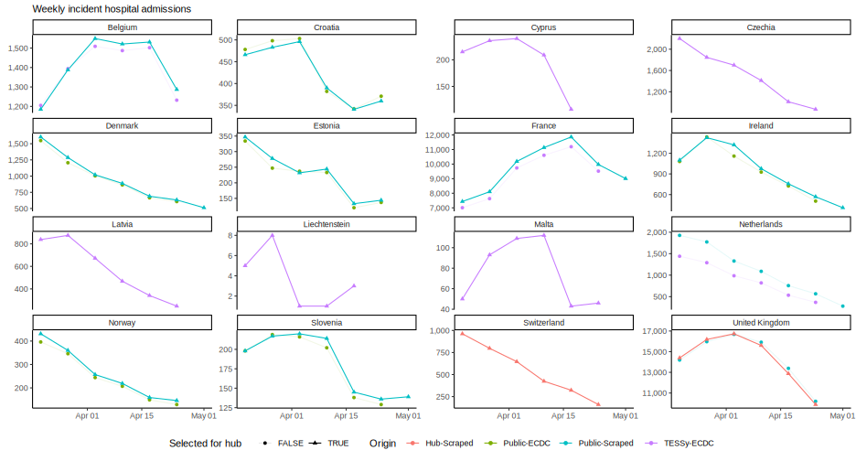

European data status
================

## Truth data

### Hospitalisations

- Belgium, Cyprus, Czechia, Denmark, Estonia, France, Germany, Greece,
  Iceland, Ireland, Italy, Latvia, Liechtenstein, Luxembourg, Malta,
  Netherlands, Slovakia, Slovenia, Spain, Switzerland

- **Data warning!** Recent missing data in: Switzerland

The Hub validates and evaluates forecasts against data collated by [Our
World in Data](https://ourworldindata.org/covid-hospitalizations),
provided in the [OWID](OWID) directory. These data are provided as
reported by national health authorities and therefore are not consistent
in definition, and care needs to be taken in interpreting them.

One particular issue that affects several of the hospitalisation data
streams it the one of right truncation. This occurs when these are
reported with a delay, and therefore recent data need to be treated as
incomplete, posing additional challenges to forecasting such data
streams and validating forecasts.

For our visualisations and assesments of forecast performance we treat
hospitalisation as *final* 28 days after the reported date. Any further
revisions will be ignored for the purposes of the Hub.

We provide multiple views of the data in order to facilitate modelling
of COVID-19 hospitalisations with a 28 day cutoff. In the
[snapshot](OWID/snapshot) directory we provide daily snapshots of the
COVID-19 hospitalisation data as collated by Our World in Data, before
any further processing is applied. The data in there are given either as
rolling weekly sums of daily data, or weekly data. In the
[final](OWID/final) directory we provide data that are considered
“final”, i.e. they stop 28 days before the latest date. The files in
this directory are the ones used for scoring the forecasts for their
performance against observed data.

The single dataset in [OWID/truth_OWID-Incident
Hospitalizations.csv](OWID/truth_OWID-Incident%20Hospitalizations.csv)
contains the latest data, where the final versions of the data are
included for dates more than 28 days before the latest snapshot date,
and the most recent version for any subsequent data. This is the dataset
recommended for use in models that can take into account the truncation
of the data. Please note that the data reported at weekly frequency has
been shifted back one day to Saturday (instead of Sunday) in that file
to comply with the Hub definition of an epidemiological week
(Sunday-Saturday).

We further provide a set of [recommended
cutoffs](OWID/recommended-cutoffs.csv) for use with these data. These
are estimates of the truncation in the number of weeks that should be
cut off the data set if the aim is to have a data set that is not
further revised by more than 5%. The corresponding dataset in
[OWID/truncated_OWID-Incident
Hospitalizations.csv](OWID/truth_OWID-Incident%20Hospitalizations.csv)
has these recent weeks removed and is recommended for use in models that
cannot take into account the truncation of the data.

The latest hospitalisation data is plotted below, with the dashed line
indicating data expecting to be substanially revised.

### Cases and deaths

We further evaluate forecasts of cases and deaths against [Johns Hopkins
University data](https://github.com/CSSEGISandData/COVID-19), and we
recommend using this dataset as the basis for forecasts.

- Daily numbers of cases and deaths are available to download from
  [JHU](https://github.com/CSSEGISandData/COVID-19/tree/master/csse_covid_19_data/csse_covid_19_time_series),
  or from [our
  repository](https://github.com/epiforecasts/covid19-forecast-hub-europe/data-truth).
- JHU also provide [country
  metadata](https://github.com/CSSEGISandData/COVID-19/blob/master/csse_covid_19_data/UID_ISO_FIPS_LookUp_Table.csv),
  including population counts and ISO-3 codes.

Note there are some differences between the format of the JHU data and
what we require in a forecast. Please check the
[Wiki](https://github.com/epiforecasts/covid19-forecast-hub-europe/wiki/Targets-and-horizons#truth-data)
for more on forecast formatting.

#### Potential issues in the JHU dataset

As of 2023-02-26

| country     | created    | updated    | issue                                                               | message                                             | url                                                      |
|:------------|:-----------|:-----------|:--------------------------------------------------------------------|:----------------------------------------------------|:---------------------------------------------------------|
| czechia     | 2023-02-24 | 2023-02-24 | why time series for czechia decreases?                              | Hi, I’m looking in \`time_series_covid19_confirmed… | <https://github.com/CSSEGISandData/COVID-19/issues/6620> |
| iceland     | 2023-01-11 | 2023-01-11 | patch iceland data from 11/01/2022 to 01/10/2023                    | November 1, 2022: 206571 cases November 8, 2022: 2… | <https://github.com/CSSEGISandData/COVID-19/issues/6462> |
| france      | 2023-01-04 | 2023-01-06 | martinique (france) cases and deaths does not match source          | In the WHO report there are 225249 cases and 1079 … | <https://github.com/CSSEGISandData/COVID-19/issues/6432> |
| netherlands | 2023-01-06 | 2023-01-06 | netherlands rivm ceases reporting covid-19 deaths as of jan 1, 2023 | Hello all, On January 1, 2023, the Netherlands’ R…  | <https://github.com/CSSEGISandData/COVID-19/issues/6446> |

Open issues updated over the last eight weeks: from [JHU CSSEGISandData
Github](https://github.com/CSSEGISandData/COVID-19/)

## Additional data sources

We do not use or evaluate against these data, but the following might be
useful for modelling targets:

| Data                | Description                                                                                                                              | Source | Link                                                                                                                            |
|---------------------|------------------------------------------------------------------------------------------------------------------------------------------|--------|---------------------------------------------------------------------------------------------------------------------------------|
| Vaccination         | Number of vaccine doses distributed by manufacturers, number of first, second and unspecified doses administered                         | ECDC   | [Data on COVID-19 vaccination in the EU/EEA](https://www.ecdc.europa.eu/en/publications-data/data-covid-19-vaccination-eu-eea)  |
| Variants of concern | Volume of COVID-19 sequencing, the number and percentage distribution of VOC for each country, week and variant submitted since 2020-W40 | ECDC   | [Data on SARS-CoV-2 variants in the EU/EEA](https://www.ecdc.europa.eu/en/publications-data/data-virus-variants-covid-19-eueea) |
| Testing             | Weekly testing rate and weekly test positivity                                                                                           | ECDC   | [Data on testing for COVID-19 by week and country](https://www.ecdc.europa.eu/en/publications-data/covid-19-testing)            |
