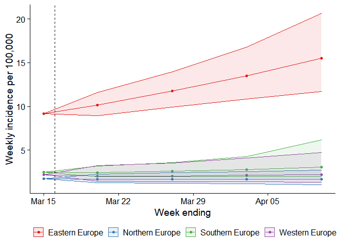
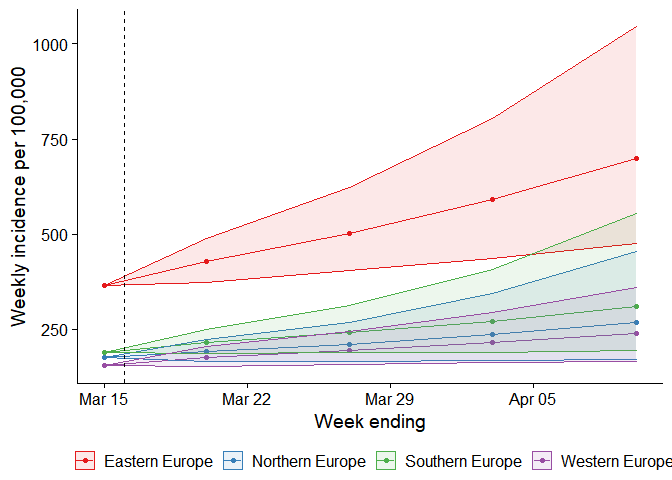

### 16 March 2021

We collect, visualise, and combine weekly forecasts of Covid-19 cases
and deaths across Europe.

On 15 March 2021, we collected forecasts from 20 teams. Each team
contributed a short-term forecast of new Covid-19 deaths or cases, for
at least one of 32 countries. We combined the forecasts using a mean
average. See the [visualisation]() or the [raw data]() for detailed
forecasts for Europe and each country.

#### Short term situation

Over the next week, forecasters largely expect cases and deaths from
Covid-19 to increase, with this trend forecast in 16 of 32 countries
across Europe. Reports of cases and deaths per 100,000 population are
expected to increase in 16 and 3 countries, respectively.

#### Trends over time

##### Deaths from Covid-19

Czechia, Hungary, and Slovakia are likely to see the highest increases
in deaths.

In Czechia, deaths are expected to increase to approximately 10 (10-20)
per 100,000 this week. Over the next four weeks, Hungary is likely to
see the greatest increase to approximately 30 (20-40) deaths per 100,000
a week by 10 April.

###### Region

###### Country

See our [main
visualisation](https://covid19forecasthub.eu/visualisation/) for maps
and country level plots of forecasts over the next four weeks.

The table below shows forecasts for the 5 countries with highest
incidence per 100,000 population. Forecasts were made this week, for the
period 14 March to 20 March 2021.

| Region          | Country  | Population | Forecast period          | Forecast weekly range | Forecast weekly per 100,000 | Trend                      |
|:----------------|:---------|-----------:|:-------------------------|:----------------------|:----------------------------|:---------------------------|
| Eastern Europe  | Czechia  | 10,591,320 | 2021-03-14 to 2021-03-20 | 1540 (1420-1680)      | 10 (10-20)                  | remain stable or uncertain |
| Eastern Europe  | Hungary  |  9,781,130 | 2021-03-14 to 2021-03-20 | 1360 (1230-1520)      | 10 (10-20)                  | increase                   |
| Eastern Europe  | Slovakia |  5,439,890 | 2021-03-14 to 2021-03-20 | 680 (600-770)         | 10 (10-10)                  | remain stable or uncertain |
| Eastern Europe  | Bulgaria |  7,075,990 | 2021-03-14 to 2021-03-20 | 760 (620-930)         | 10 (10-10)                  | remain stable or uncertain |
| Northern Europe | Estonia  |  1,315,480 | 2021-03-14 to 2021-03-20 | 80 (70-100)           | 10 (0-10)                   | remain stable or uncertain |

##### Cases of Covid-19

Estonia, Czechia, and Hungary are likely to see the highest increases in
cases.

In Estonia, cases are expected to increase to approximately 870
(770-970) per 100,000 this week. Over the next four weeks, Hungary is
likely to see the greatest increase to approximately 1560 (1120-2160)
cases per 100,000 a week by 10 April.

###### Region

###### Country

See our [main
visualisation](https://covid19forecasthub.eu/visualisation/) for maps
and country level plots of forecasts over the next four weeks.

The table below shows forecasts for the 5 countries with highest
incidence per 100,000 population. Forecasts were made this week, for the
period 14 March to 20 March 2021.

| Region          | Country | Population | Forecast period          | Forecast weekly range  | Forecast weekly per 100,000 | Trend                      |
|:----------------|:--------|-----------:|:-------------------------|:-----------------------|:----------------------------|:---------------------------|
| Northern Europe | Estonia |  1,315,480 | 2021-03-14 to 2021-03-20 | 11400 (10110-12800)    | 870 (770-970)               | remain stable or uncertain |
| Eastern Europe  | Czechia | 10,591,320 | 2021-03-14 to 2021-03-20 | 77080 (66980-88040)    | 730 (630-830)               | remain stable or uncertain |
| Eastern Europe  | Hungary |  9,781,130 | 2021-03-14 to 2021-03-20 | 67570 (60660-75030)    | 690 (620-770)               | increase                   |
| Southern Europe | Malta   |    465,290 | 2021-03-14 to 2021-03-20 | 2380 (2060-2750)       | 510 (440-590)               | increase                   |
| Eastern Europe  | Poland  | 37,975,840 | 2021-03-14 to 2021-03-20 | 136380 (115000-160370) | 360 (300-420)               | increase                   |
