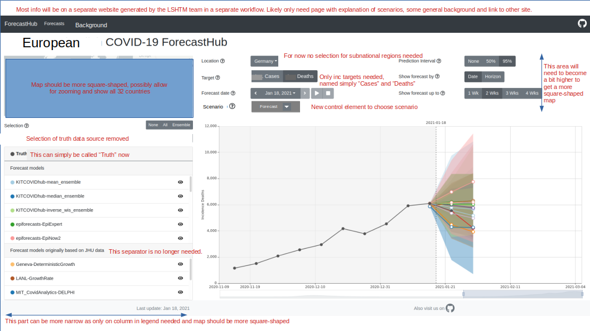
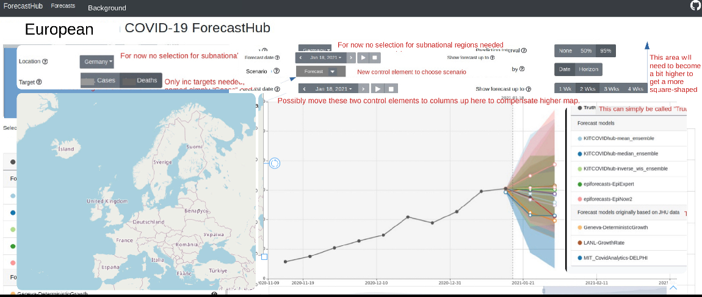

(I am writing this in English so that the LSHTM team can comment if necessary.)

## Updated files to read in

The following files will be produced by the Hub repo for use by the Angular app. For now I stored examples files at https://github.com/jbracher/covid19-forecast-hub-europe/tree/main/viz

- `forecasts_to_plot.csv` is the same as in the German/Polish Hub, with two small differences:
	- `truth_data_source`, `shift_ECDC`, `shift_JHU` and `first_commit_date` are no longer relevant and have been removed
	- there is a new column `scenario` denoting the scenario (i.e. assumptions) under which the forecast is made. In the beginning this will always be `"forecast"`. See explanation below.
- `truth_data_to_plot.csv` is the same as in the German/Polish Hub, but only contains `inc_case` and `ìnc_death` (the cumulative targets are not included in the new Hub). There is no distinction between `truth_data_to_plot_ecdc.csv` and `truth_data_to_plot_jhu.csv` as we are only using one data set.
- `location_codes.csv` is what `state_codes.csv` used to be. It contains abbreviation codes and population numbers for the different countries (the codes are ISO 3166-1 alpha-3 codes https://en.wikipedia.org/wiki/ISO_3166-1_alpha-3#BES rather than the FIPS codes used in the German/Polish Hub. If codes `"GM"` or `"PL"` are hard-coded anywhere this may cause trouble). **Warning**: I re-named the file and columns to have a more coherent terminology. The columns are now named `location_code` and `location_name` instead of `state_code` and `state_name`.
- `scenario_codes.csv` contains abbreviations and short descriptions for the different scenarios. Similar to `location_codes` this shall serve to use the correct labelling in the user interface (dropdown menu "Scenario", see below).
- The shape file behind the map will need to be updated to include the 32 countries listed in `location_codes.csv`. However, I don't know how this currently works and where these files are stored/taken from.

## Changes in the functioning of the app

I try to describe the main changes in the desired functioning of the app. As I only have a superficial understanding of how the app works these things my cause more trouble than I think, please let me know about problems that may arise.

- **There will only be one truth data source** rather than two. This means that the following features of the current app are no longer needed:
  - The UI element "Shift forecasts to" can be removed.
  - The legend with model names will only have one column and the separate display of "Forecast models originally based on JHU data" is no longer needed.
  - Only one truth curve will be shown in the plot. We should keep the darker one with round dots.
  - In the processing of the forecast data, `shift_ECDC` and `shift_JHU` do no longer need to be added to the `value` column. In fact, `shift_ECDC` and `shift_JHU` do no longer exist in `forecasts_to_plot.csv`.
- The **map** will need to be updated to contain all 32 countries listed in `location_codes.csv`, making it approxiately square shaped. Would it be possible to have a zoom functionality activated?
- At least in the beginning there will not be any sub-national forecasts. The dropdown menu for the regions can thus be removed.
- **There will only be incidence targets**, no cumulative targets. The control elements referring to the cumulative targets can be removed.
- We would like to be able to also **display various scenarios**. The "baseline" short-term forecasts we are usually dealing with are treated as one of these scenarios; other scenarios could e.g. be different vaccination strategies and their impact in the longer run. This extension causes the following changes (and likely some I am not yet aware of):
  - There needs to be a new dropdown menu "Scenario" to select which scenario to display. The options for this menu and how they map to the `scenario` column in the `forecasts_to_plot.csv` file are stored in `scenario_codes.csv` (similar to the way we are already doing it for the region codes).
  - In the beginning the only scenario we will have will be `forecast`.
  - For each country and target, a separate time series will need to be prepared for each scenario (I don't really know how you are doing that).
  

## Sketch of adapted user interface

The adapted user interface with the minimum possible changes would look something like this:

Sebastian has suggested to re-arrange things a bit given the new proportions of the map and have something like this. However, we have no idea how much work such an adaptation is given the Angular constraints and this adjustent has low priority.

  
## Open questions

- A third target related to **hospitalizations** may be added in the future. How much work would it be to add that later?